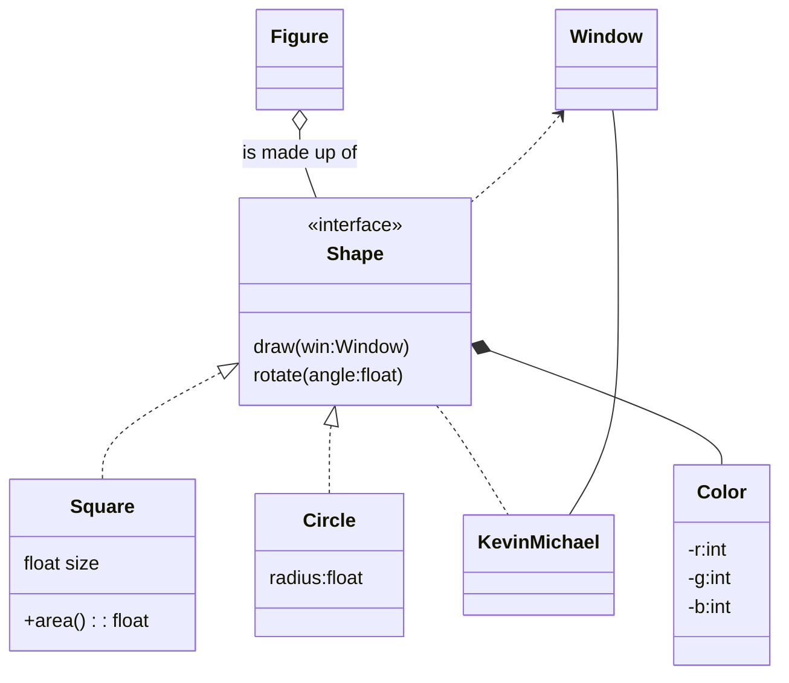

```mermaid
classDiagram
  class Shape {
    <<interface>>
    draw(win:Window)
    rotate(angle:float)
  }

    class Square {
    float size

    +area() : float
  }

  class Circle {
    radius:float
  }
  class Figure{

  }

  class KevinMichael{

  }

  class Color{
    -r:int
    -g:int
    -b:int
  }


  class Window{

  }


  Shape <|.. Square
  Shape <|.. Circle
  Figure o-- Shape : is made up of
  Shape .. KevinMichael
  Window -- KevinMichael
  Shape *-- Color
  Window <.. Shape

```
